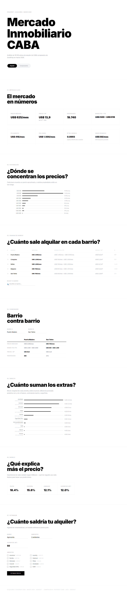
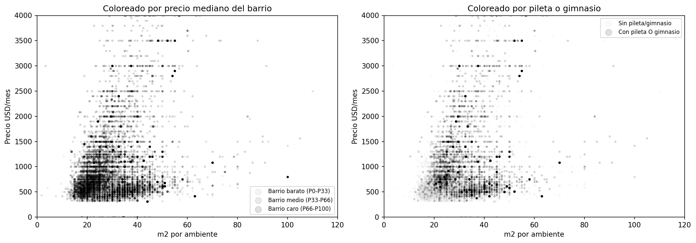
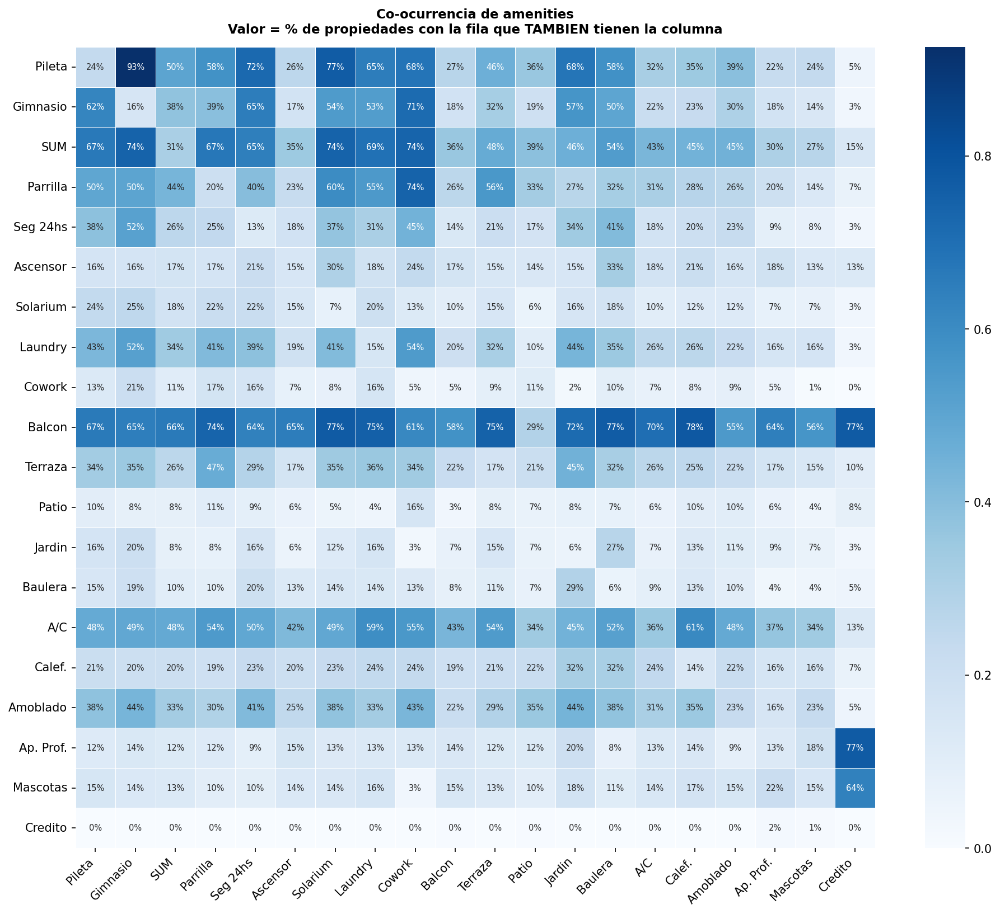
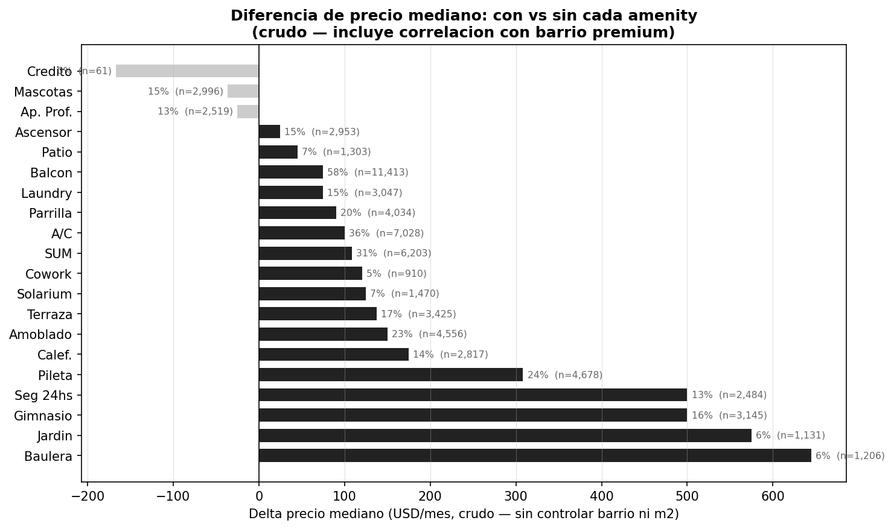
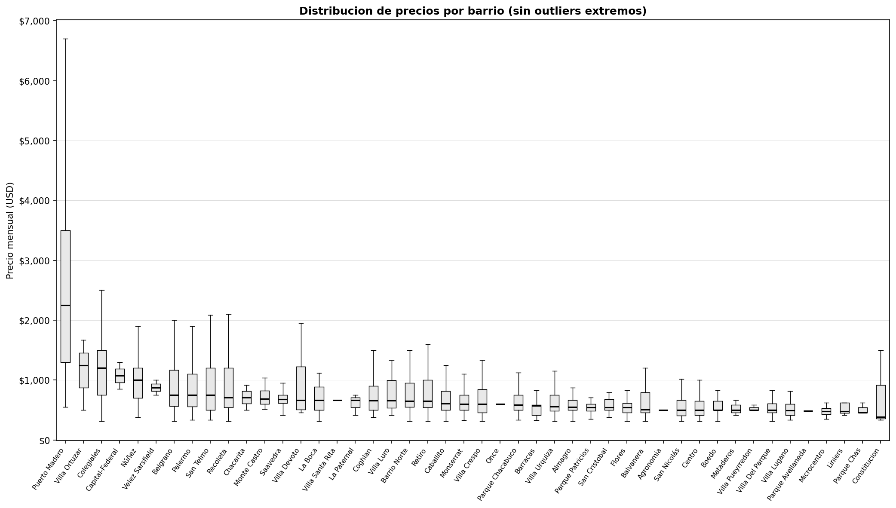
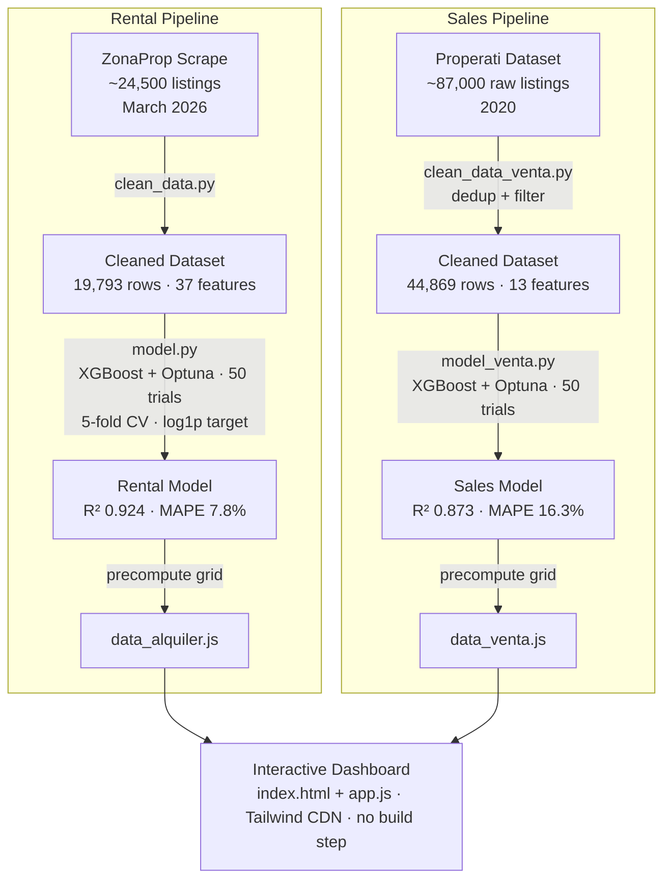

# Buenos Aires Real Estate Analytics

**End-to-end ML pipeline for predicting rental and sale prices across 46 neighborhoods in Buenos Aires.**  
Scraped 24,500 listings from ZonaProp, trained two XGBoost models tuned with Optuna, and shipped an interactive dashboard — no backend, no framework, no build step.


---

## Results at a Glance

| | Rentals (ZonaProp 2026) | Sales (Properati 2020) |
|---|---|---|
| **R²** | **0.924** | 0.873 |
| **MAE** | **$80 / month** | $41,400 |
| **MAPE** | **7.8%** | 16.3% |
| **Within ±15%** | **80.3%** of predictions | 56.9% |
| Records | 19,793 | 44,869 |
| Neighborhoods | 46 | 57 |
| Features | 37 | 13 |

> The sales model's higher error reflects structural difficulty: price range spans $57K–$1.58M (25× wider than rentals) with no amenity data available.

---

## Dashboard



A static web app served from a single `index.html` — no API calls, no backend. Model output is precomputed as a lookup grid (46 neighborhoods × 5 room counts × 10 m² breakpoints) and shipped as a JS file.

**Sections:**
- Market overview — median price, P10/P90 range, model R² and MAE
- Price distribution histogram
- Neighborhood ranking with live search
- Side-by-side neighborhood comparator
- Amenity marginal effects bar chart
- Feature importances
- Interactive price estimator

---

## Key Findings

**1. There are two distinct rental markets in Buenos Aires.**  
Cheap neighborhoods (P0–P33) show almost no correlation between apartment spaciousness and price (r ≈ +0.08) — rents cluster tightly around the neighborhood median regardless of layout. Premium neighborhoods (P66–P100) show a clear positive correlation (r ≈ +0.35) — here, more space per room translates directly to higher price. Adding a neighborhood median price feature (`precio_med_barrio`) was the single largest model improvement of the project: CV MAE dropped from 0.082 → 0.079, MAPE from 8.2% → 7.8%.


*Left: colored by neighborhood price tercile. Right: colored by pool/gym presence. Pool and gym explain most of the upper cluster — they act as proxies for premium-building status.*

**2. Pool and gym are not amenities — they are signals.**  
They co-occur in 93% of listings and rank as the top two feature importances despite the model having dozens of other variables. They proxy for the whole cluster of quality signals (doorman, concierge, rooftop, finishes) that the scraper doesn't capture. Tested merging them — all 3 variants degraded CV MAE. They stay separate.


*P(gym | pool) = 93%, P(pool | gym) = 93%. Building amenities form a single coherent cluster.*

**3. Furnished apartments have the highest marginal value (+$124/month).**  
Amenity deltas after controlling for neighborhood and m²:

| Amenity | Monthly delta | Market prevalence |
|---------|:---:|:---:|
| Furnished | **+$124** | 23% |
| Parking | **+$111** | 18% |
| Gym | **+$87** | 16% |
| Pool | **+$85** | 24% |
| BBQ grill | **+$30** | 20% |
| 24h security | **+$11** | 13% |
| A/C | +$5 | 36% |
| Common room | +$2 | 31% |
| Balcony | +$2 | 58% |


*Raw deltas (without controlling for neighborhood) are inflated: garden (+$650) and storage (+$640) appear valuable but their prevalence is only 6% and they cluster in expensive neighborhoods. Garden and storage are excluded from the dashboard export but the model sees them.*

**4. Puerto Madero is a market unto itself — but its outliers are real.**  
At $2,300/month median, it's 3.7× the city median. Initial investigation suggested filtering its high-priced listings; closer inspection revealed they are legitimate ultra-luxury properties (Alvear Icon, Torres El Faro, The Link — penthouses at $5,000–$7,000/month). A per-neighborhood IQR filter would incorrectly remove premium listings from cheap neighborhoods too (Almagro, Flores, Barracas each had 100+ "outliers" that were just standard 3-bedroom apartments). Global P1–P99 filter was retained.



**5. The model ceiling is the missing data, not the algorithm.**  
Floor number, building age, and orientation are 100% null in the scraped data. These are the two dominant error patterns:
- *Model overestimates*: old building in premium neighborhood — assigns premium-neighborhood price without knowing it's a 1970s walkup
- *Model underestimates*: penthouse in premium neighborhood — can't distinguish a top-floor unit from a standard floor

All six engineered features tested to address this (m²-ratio-per-neighborhood, amenity density, luxury tiers) degraded CV MAE and were discarded.

---

## Pipeline



---

## Data Cleaning

### Rentals (`clean_data.py`)

| Step | Action | Impact |
|------|--------|--------|
| Price sanity | Drop < $300 or > $5,000/month USD | ~645 rows |
| Short-term filter | Regex on title: `temporari`, `turístic`, `diario`, `semanal`, `airbnb` | ~2,700 rows |
| Price recovery | 77 listings had truncated ARS prices ("$ 780" → "$ 780.000") — multiplied × 1000 and reconverted | +53 rows recovered |
| Neighborhood recovery | Extract barrio from `address` field using 48 CABA patterns; apply Unicode normalization for encoding variants | Recovers ~80% of 6,700 nulls |
| Surface filter | Keep 15–400 m²; price/m² between $2–$150 USD | ~1,200 rows |
| Null imputation | `dormitorios` ← `ambientes − 1` (valid in 83% of cases) | — |
| **Final** | **19,793 rows · 0 nulls in retained columns** | — |

### Sales (`clean_data_venta.py`)

Properati requires deduplication: 42,654 re-listings (46% of raw) removed, keeping the most recent `end_date` per property. Price filter: P1–P99 ($57K–$1.58M) + price/m² between $500–$8,000.

---

## Model

### Feature Groups (Rentals — 37 total)

| Group | Features |
|-------|----------|
| Location | `barrio_enc` (label encoding, 46 barrios), `precio_med_barrio` (neighborhood median from train set only) |
| Size | `superficie`, `ambientes`, `dormitorios`, `banos`, `cochera_cantidad` |
| Engineered | `m2_por_ambiente`, `amenity_score_edificio`, `amenity_score_depto`, `es_monoambiente`, `tiene_espacio_exterior`, `es_edificio_premium` |
| Building amenities | `pileta`, `gimnasio`, `sum`, `parrilla`, `seguridad_24hs`, `ascensor`, `solarium`, `laundry`, `cowork` |
| Unit amenities | `balcon`, `terraza`, `patio`, `jardin`, `baulera`, `aire_acondicionado`, `calefaccion`, `amoblado` |
| Conditions | `apto_profesional`, `acepta_mascotas`, `apto_credito` |

`precio_med_barrio` is computed exclusively from the training split before fitting to prevent data leakage. Label encoding outperforms one-hot for this dataset (46 well-represented categories; XGBoost learns non-monotonic splits across the integer values).

### Target Transform

Both models use `log1p(price)` as the optimization target with predictions via `expm1()`. This makes Optuna minimize proportional errors rather than absolute ones, reducing bias toward high-value properties. For rentals: R² improved 0.897 → 0.924, MAE $89 → $80 vs. linear-scale baseline.

### Hyperparameter Tuning

Bayesian search with Optuna (5-fold CV, MAE in log-space):

| Parameter | Search range | Best (rentals) | Best (sales) |
|-----------|-------------|----------------|--------------|
| `n_estimators` | 200 – 1000 | 766 | 958 |
| `max_depth` | 3 – 8 | 8 | 7 |
| `learning_rate` | 0.01 – 0.3 | 0.063 | 0.045 |
| `subsample` | 0.6 – 1.0 | 0.878 | 0.910 |
| `colsample_bytree` | 0.6 – 1.0 | 0.601 | 0.654 |
| `min_child_weight` | 1 – 10 | 4 | 2 |
| `reg_alpha` | 1e-4 – 10 | 0.264 | 0.001 |
| `reg_lambda` | 1e-4 – 10 | 1.903 | 0.025 |

### Model Evolution (Rentals)

| Change | R² | MAE | MAPE |
|--------|-----|-----|------|
| LinearRegression baseline | 0.897 | $89 | 9.3% |
| XGBoost + Optuna | 0.910 | $84 | 8.2% |
| + log1p target transform | 0.923 | $82 | — |
| + `precio_med_barrio` feature | **0.924** | **$80** | **7.8%** |

---

## Project Structure

```
├── scripts/
│   ├── clean_data.py          # Rental cleaning: encoding fix, temp filter, barrio recovery
│   ├── model.py               # Rental model: XGBoost + Optuna, exports results.json + data_alquiler.js
│   ├── eda_viz.py             # EDA visualizations → output/eda/
│   ├── clean_data_venta.py    # Sales cleaning + deduplication
│   ├── model_venta.py         # Sales model
│   ├── eda_viz_venta.py       # Sales EDA → output/eda_venta/
│   └── test_features.py       # Feature comparison harness (fixed params, no Optuna noise)
├── web/
│   ├── index.html             # Dashboard — single file, Tailwind CDN
│   ├── app.js                 # All frontend logic
│   ├── data_alquiler.js       # Rental model output (prediction grid + market stats)
│   └── data_venta.js          # Sales model output
├── output/
│   ├── eda/                   # Rental EDA plots (6 PNG)
│   ├── eda_venta/             # Sales EDA plots (6 PNG)
│   ├── results.json           # Rental model full output
│   └── results_venta.json     # Sales model full output
├── docs/
│   └── modelo.md              # Full model log: decisions, metrics, rejected features, change history
├── data/
│   ├── raw/                   # Original CSVs — not committed
│   └── processed/             # Cleaned CSVs — not committed
├── requirements.txt
└── .gitignore
```

---

## How to Run

```bash
# Install dependencies
pip install -r requirements.txt

# Rental pipeline
python scripts/clean_data.py
python scripts/model.py               # 50 Optuna trials (~10 min)
python scripts/model.py --fast        # 20 trials for development

# Sales pipeline
python scripts/clean_data_venta.py
python scripts/model_venta.py

# EDA visualizations
python scripts/eda_viz.py             # → output/eda/
python scripts/eda_viz_venta.py       # → output/eda_venta/

# Serve dashboard locally
cd web && python -m http.server 8080
# Open http://localhost:8080
```

> **Note:** raw data files are not included in this repository. The `data/raw/` directory must be populated with the original CSVs before running the pipeline. Processed files and model outputs (`results.json`, `data_alquiler.js`) are committed so the dashboard works out of the box.

---

## Tech Stack

**Data & ML:** Python 3.11 · pandas · NumPy · scikit-learn · XGBoost · Optuna · Matplotlib · seaborn

**Frontend:** Vanilla JS · Tailwind CSS (CDN) · no build step

**Tooling:** Puppeteer (screenshot regression testing)

---

## Limitations

- **Floor and age data unavailable** — both 100% null in the scrape. The two dominant error patterns (old building in premium neighborhood; penthouse without floor data) cannot be addressed without re-scraping.
- **No interaction terms in the predictor** — amenity deltas are global averages. A gym in Puerto Madero is worth more than a gym in Villa Lugano; the estimator doesn't capture this.
- **Sales data is 2020** — the Buenos Aires property market has changed significantly. The sales model is a structural benchmark, not a current valuation tool.
- **Label encoding for neighborhoods** — XGBoost may learn spurious ordinal relationships between unrelated barrios encoded as adjacent integers. Mitigated by `precio_med_barrio` which gives the model an explicit price-ordered signal.

---

## Author

**Lucas Niederle**  
[GitHub](https://github.com/loquillitas) · [LinkedIn](https://www.linkedin.com/in/lucas-niederle-aba588330)

---

*Data: ZonaProp scrape (rentals, Buenos Aires, March 2026) · Properati public dataset (sales, 2020). For research and portfolio purposes.*
