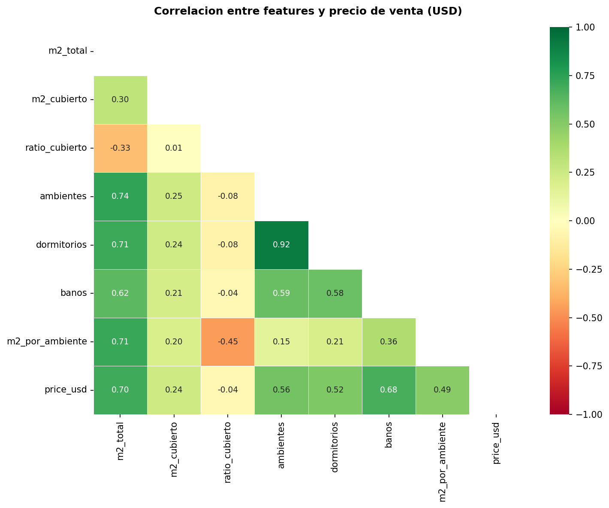
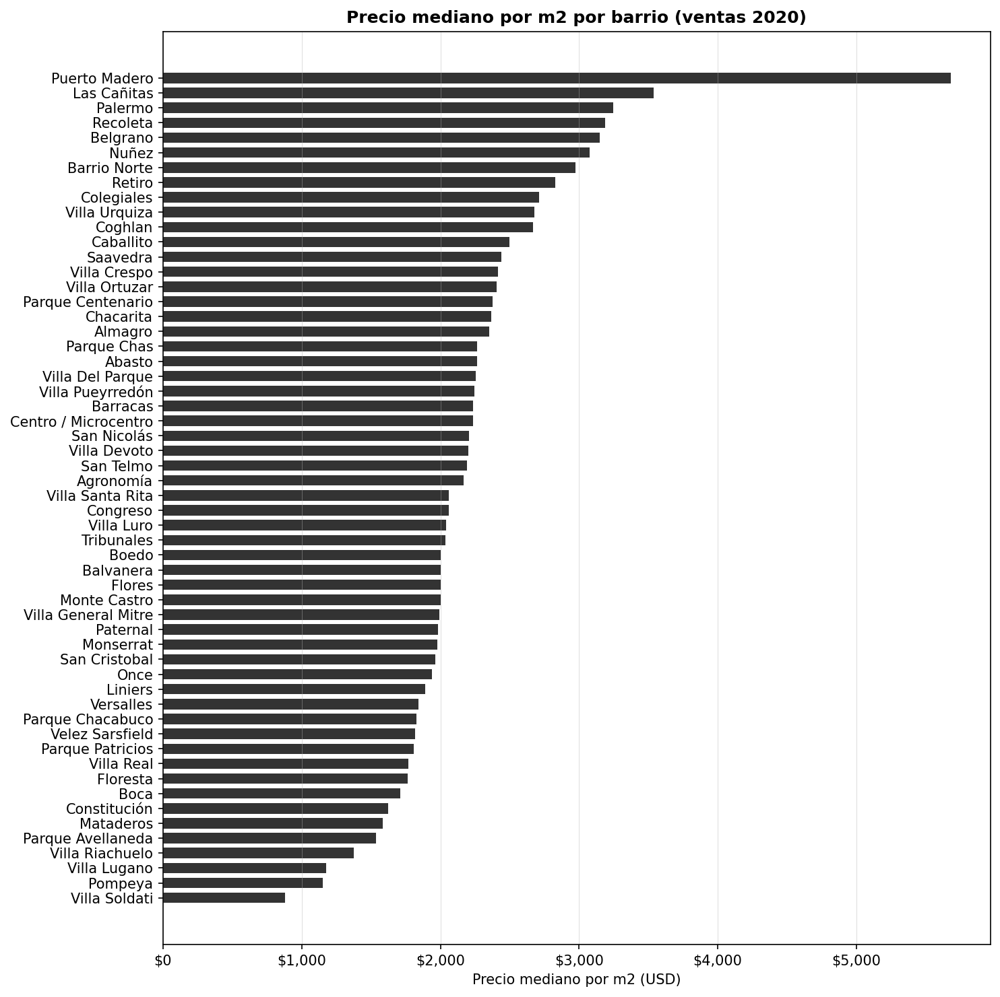
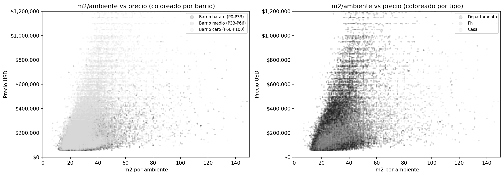

# Modelo de precios — Alquileres CABA 2026

## Estado actual

**Algoritmo:** XGBoost (`xgboost.XGBRegressor`)
**Target:** `log1p(price_ref_usd)` — log del precio mensual en USD; predicciones en USD via `expm1()`
**Split:** 80% train / 20% test, `random_state=42`
**Normalización:** no requerida para XGBoost; log-transform aplicado al target (no a features)
**Tuning:** Optuna — búsqueda bayesiana sobre MAE en log-space, 100 trials en producción, 20 en desarrollo (`--fast`)

---

## Métricas de performance

| Métrica | Valor | Significado |
|---|---|---|
| R² | 0.9317 | 93.2% de la variación del precio explicada |
| MAE | $76 USD/mes | Error promedio absoluto en USD reales |
| RMSE | $205 USD/mes | Raíz del error cuadrático medio (sensible a outliers) |
| MAPE | 7.5% | Error porcentual promedio por propiedad |
| ±15% | 81.5% | % de predicciones dentro del ±15% del precio real |
| MAE% | 8.5% | MAE como % del precio promedio |
| Registros | 19.793 | Post feature engineering (dropna barrio + ambientes) |

> Valores con 100 trials (run de producción, 2026-05-20).

### Comparación de variantes evaluadas (sin retuning)

| Variante | R² | MAE | RMSE | MAPE | ±15% |
|---|---|---|---|---|---|
| Label enc + lineal (anterior) | 0.8966 | $89 | $247 | 9.3% | 78.6% |
| Target enc + lineal | 0.8909 | $90 | $253 | 9.3% | 79.1% |
| **Label enc + log(target) (actual)** | **0.9245** | **$81** | **$216** | **8.0%** | **80.5%** |
| Target enc + log(target) | 0.8950 | $86 | $248 | 8.3% | 80.5% |

**Conclusiones:**
- Target encoding no mejora sobre label encoding con XGBoost (46 categorías bien representadas, el modelo aprende splitting no-monótono a través de múltiples niveles).
- Log-transform del target mejora todas las métricas: el modelo optimiza errores proporcionales en lugar de absolutos, reduciendo el sesgo hacia propiedades de precio alto.

---

## Features usadas

**Base (41 features en total):**

| Grupo | Features |
|---|---|
| Ubicación | `barrio_enc` (label encoding — 46 barrios), `precio_med_barrio` (mediana USD del barrio, calculada en train) |
| Numéricas | `superficie`, `ambientes`, `dormitorios`, `banos`, `cochera_cantidad` |
| Derivadas | `m2_por_ambiente`, `m2_por_bano`, `amenity_score_edificio`, `amenity_score_depto`, `es_monoambiente`, `tiene_espacio_exterior`, `es_edificio_premium` |
| Calidad/disposición | `disposicion_enc` (Frente=3, Contrafrente=2, Interno=1, Lateral=0, desconocido=−1), `estado_enc` (A estrenar=5…A reciclar=0, desconocido=3) |
| Publicador | `publisher_enc` (inmobiliaria/desarrolladora=2, particular/emprendimiento=1, desconocido=1) |
| Amenities edificio | `pileta`, `gimnasio`, `sum`, `parrilla`, `seguridad_24hs`, `ascensor`, `solarium`, `laundry`, `cowork` |
| Amenities depto | `balcon`, `terraza`, `patio`, `jardin`, `baulera`, `aire_acondicionado`, `calefaccion`, `amoblado` |
| Condición | `apto_profesional`, `acepta_mascotas`, `apto_credito` |

**Notas:**
- `dormitorios` imputado como `ambientes - 1` donde es nulo (28% de filas, mayormente monoambientes)
- `disposicion` tiene 54.6% de nulos — el valor −1 es una categoría propia que XGBoost aprende a tratar como "sin información"
- `estado` tiene 79.7% de nulos — imputado con 3 (Muy bueno = mediana de la distribución)
- `publisher_enc`: señal posiblemente confundida con barrio premium (inmobiliarias tienen más propiedades caras). Se mantiene porque mejora CV, pero no tiene justificación causal clara.
- Barrio con label encoding en lugar de one-hot: XGBoost maneja splitting sobre variables ordinales sin explotar dimensionalidad

---

## Hiperparámetros (mejor trial de Optuna, 100 trials — run de producción)

| Parámetro | Valor |
|---|---|
| `n_estimators` | 806 |
| `max_depth` | 8 |
| `learning_rate` | 0.04256 |
| `subsample` | 0.9140 |
| `colsample_bytree` | 0.6756 |
| `min_child_weight` | 1 |
| `reg_alpha` | 0.0626 |
| `reg_lambda` | 0.000220 |

Búsqueda bayesiana con Optuna (CV 5-fold, métrica: MAE en log-space). Mejor CV = 0.0760.

---

## Feature importances (top 5)

| Feature | Importance |
|---|---|
| Pileta | 0.2495 |
| Gimnasio | 0.1943 |
| Superficie (m²) | 0.1415 |
| Cochera | 0.0567 |
| Amoblado | 0.0332 |

> Pileta y Gimnasio con importancia alta sugiere que el modelo los usa como proxy de "edificio premium".
> Considerar en próxima iteración si conviene reemplazarlos por `es_edificio_premium` para reducir este efecto.

---

## Impacto de amenities (efectos marginales del modelo)

Efecto promedio de agregar cada amenity sobre el precio predicho,
manteniendo constantes todas las demás variables (contrafactual sobre el dataset completo).

**Filtros aplicados en la exportación: pct_con ≥ 10% y delta ≥ 0.**

Amenities excluidos y por qué:

| Amenity | Delta crudo | Motivo de exclusión |
|---|---|---|
| Jardín | +$650 (crudo) | Solo 6% del mercado (pct_con < 10%). Delta crudo alto porque los deptos con jardín están concentrados en barrios caros y casas PH. El modelo lo ve, no se exporta al dashboard. |
| Baulera | +$640 (crudo) | Igual: 6% del mercado. Misma explicación: correlación con propiedades grandes en barrios caros. |
| Ascensor | −$30 (crudo) | Delta negativo en datos crudos. Edificios con ascensor pero sin otras amenities son edificios viejos estándar en zonas densas — no son premium. El modelo aprende que ascensor solo correlaciona con antigüedad y menor precio relativo. |
| Calefacción | negativo | Ídem: correlaciona con edificios viejos que tienen calefacción central (no split moderno), señal de menor calidad. |
| Terraza | ~$0 | Delta marginal nulo una vez controlado barrio y m². Las terrazas aparecen en todos los segmentos de precio. |
| Acepta mascotas | negativo | El propietario que lo publicita como diferencial suele hacerlo porque la propiedad no compite por otros atributos. Correlación con precio bajo. |
| Apto profesional | negativo | Ídem: propietarios que necesitan ampliar el público porque la propiedad no se alquila fácilmente. |

> **Nota metodológica:** el delta "crudo" (diferencia de medianas sin control) es muy diferente del delta del modelo (controlando barrio y m²). Jardín y baulera tienen delta crudo ~$650 porque las propiedades con esas características están en barrios caros. El modelo descompone eso: una vez que controla por barrio y superficie, el efecto marginal de jardín/baulera es mucho menor.

| Amenity | Delta USD/mes | % del mercado |
|---|---|---|
| Amoblado | +$124 | 23.0% |
| Cochera | +$111 | 18.2% |
| Gimnasio | +$87 | 15.9% |
| Pileta | +$85 | 23.7% |
| Parrilla | +$30 | 20.4% |
| Seguridad 24hs | +$11 | 12.6% |
| Aire acondicionado | +$5 | 35.6% |
| SUM | +$2 | 31.4% |
| Balcón | +$2 | 57.8% |
| Terraza | +$2 | 17.3% |

Nota: cochera se calcula como cochera_cantidad=1 vs cochera_cantidad=0 (es una variable
numérica, no booleana). M2 descubierto no está disponible en alquileres (100% nulos).

---

## Exportaciones del modelo

El JSON exportado contiene estos bloques para el dashboard:

| Bloque | Uso en la web |
|---|---|
| `kpis` | Sección 01 — métricas clave del mercado |
| `distribucion` | Sección 02 — histograma de precios |
| `barrios` | Secciones 03 y 04 — ranking y comparador |
| `impacto_amenities` | Sección 05 — impacto de amenities |
| `feature_importances` | Sección 06 — qué explica el precio |
| `predictor` | Sección 07 — estimador interactivo |

Archivos generados: `output/results.json` y `web/data_alquiler.js`

---

## Limitaciones conocidas

- **Barrio como label encoding:** el modelo puede aprender ordinalidad espuria (barrio 3 > barrio 2 > barrio 1 sin sentido geográfico). Alternativa: one-hot o embeddings. Impacto práctico bajo dado que XGBoost hace splits binarios sobre el valor numérico.
- **Predictor con 0 amenities como baseline:** las propiedades de 0 amenities son atípicas, por lo que los deltas del predictor pueden sobreestimar el valor de amenities en edificios ya equipados.
- **Interacciones no capturadas en deltas:** "pileta en Palermo" genera un delta mayor que "pileta en Flores". El predictor usa un delta único por amenity (promedio sobre todos los barrios).
- **Features faltantes (100% nulos):** `piso`, `antiguedad`, `orientacion` son los campos que más explicarían los errores grandes del modelo, pero están 100% nulos en el dataset scrapeado. Techo actual del modelo: ~8% MAPE sin estos datos.

---

## Análisis de errores del modelo

Revisados los peores casos de predicción en el test set (residuos > 2σ). Dos patrones dominantes:

### Patrón A — Modelo sobreestima: depto barato en barrio caro
- **Ejemplo:** Recoleta, $700/mes real vs $1.800 predicho. Ratio vs mediana del barrio: 0.39×.
- **Causa:** edificio viejo o mal estado en barrio premium. El modelo no tiene features de antigüedad ni condición (100% nulos en el scraping). Asigna precio de barrio sin poder distinguir calidad del edificio.

### Patrón B — Modelo subestima: ultra-premium en barrio caro
- **Ejemplo:** Puerto Madero, $5.000/mes real vs $2.700 predicho. Ratio vs mediana del barrio: 2.60×.
- **Causa:** penthouse / piso alto con vista. El modelo no tiene `piso` ni `m2_descubierto` (ambos 100% nulos). Sin esos datos, no puede distinguir un depto estándar de uno de lujo en el mismo edificio.

### Features nuevas evaluadas (no incorporadas)

Probadas 3 features derivadas para atacar estos patrones. Ninguna mejoró las métricas — descartadas según regla "si no mejora, no entra".

| Feature | R² | MAE | RMSE | MAPE | ±15% | Resultado |
|---|---|---|---|---|---|---|
| Baseline (log + features actuales) | 0.9111 | $83 | $229 | 8.1% | 80.2% | — |
| + `m2_ratio_barrio` (superficie vs mediana del barrio) | 0.9086 | $83 | $232 | 8.0% | 80.8% | Descartada |
| + `amenity_density` (amenities / ambientes) | 0.9090 | $84 | $231 | 8.1% | 80.3% | Descartada |
| + `banos_por_ambiente` | 0.9092 | $84 | $231 | 8.1% | 80.4% | Descartada |
| + las 3 juntas | 0.9082 | $84 | $232 | 8.1% | 80.4% | Descartadas |
| + `amenity_score_edificio_m2` (score edificio / superficie) | 0.9046 | $86 | $237 | 8.3% | 79.8% | Descartada |
| + `luxury_tier` (4 niveles: básico/semi/premium/ultra) | 0.9045 | $85 | $237 | 8.1% | 79.7% | Descartada |
| + `luxury_tier` + `amenity_score_edificio_m2` | 0.9040 | $86 | $238 | 8.2% | 79.7% | Descartadas |

**Conclusión:** el modelo ha llegado a un techo con los datos disponibles. Todas las features derivadas probadas son funciones deterministas de variables que XGBoost ya tiene — el modelo aprende los mismos splits por sí solo sin necesitar la precomputación explícita.

### Merge pileta+gimnasio — resultado

EDA revela que pileta y gimnasio co-ocurren en el **93% de los casos** (heatmap de co-ocurrencia). Se testeó si mergeandolos mejora métricas:

| Variante | CV_MAE_log | R² test | MAE | RMSE | Resultado |
|---|---|---|---|---|---|
| Baseline (pileta + gimnasio separados + es_edificio_premium) | **0.0820** | 0.9157 | $85 | $228 | — |
| − pileta − gimnasio (solo es_edificio_premium) | 0.0828 | 0.9126 | $86 | $232 | Descartada |
| − pileta − gimnasio + tiene_premium (OR) | 0.0828 | 0.9131 | $85 | $231 | Descartada |
| − pileta − gimnasio − es_edificio_premium (solo score) | 0.0828 | 0.9209 | $83 | $221 | Descartada* |

*La Variante C mejora en métricas de test pero empeora en CV (0.0828 vs 0.0820). El CV es la métrica más confiable (5-fold en train). Se descarta — el aparente gain en test es ruido de la partición.

**Conclusión merge:** las features individuales de pileta y gimnasio aportan información que `amenity_score_edificio` no captura completamente, aun siendo 93% correlacionadas. XGBoost las usa para splits distintos en diferentes profundidades del árbol. Se mantienen separadas.

### Análisis de outliers por barrio

Investigado si aplicar un filtro de outliers per-barrio (IQR: Q3 + 1.5×IQR) mejoraría el modelo o la limpieza de datos.

**Resultado: filtro global P1-P99 es mejor para este dataset.**

Razones:
- Los outliers altos de Puerto Madero son **propiedades legítimas de ultra-lujo**: Alvear Icon piso 28, Torres El Faro piso 42, The Link Towers, penthouses de 288m²+ a $6.000-$7.000/mes. No son errores de parsing.
- Los barrios con más "outliers" estadísticos por IQR son los **barrios baratos** (Barrio Norte 176, Almagro 139, Flores 117, Parque Patricios 98), donde incluso un departamento de $1.200 queda fuera de Q3+1.5×IQR respecto de una mediana de $540. Esas propiedades son premium legítimas y su exclusión dañaría el training.
- Un filtro per-barrio eliminaría precisamente los ejemplos que el modelo necesita para aprender que "un 3amb de $1.200 en Flores existe y tiene estas características".
- Puerto Madero: umbral mild = $6.800 — solo 3-4 listings quedarían fuera. Sin beneficio práctico. Los errores grandes son sistemáticamente causados por la falta de `piso` y `antiguedad` — variables que ZonaProp no expone en el scraping. No hay feature derivada que pueda sustituirlas.

---

## Visualizaciones clave del EDA

Solo se incluyen los gráficos que derivaron en una decisión concreta de modelo o datos.

---

### Gráfico: Co-ocurrencia de amenities

**Lectura:** cada celda = % de propiedades con la amenity de la fila que TAMBIÉN tienen la de la columna.

**Hallazgo:** Pileta y Gimnasio co-ocurren en el **93% de los casos** — son prácticamente la misma variable. Cluster premium = {pileta, gimnasio, sum, laundry, solarium}.

**Decisión:** se testeó merge de pileta+gimnasio en 3 variantes. Todas empeoraron el CV. Las features individuales se mantienen separadas porque XGBoost extrae splits distintos de cada una aun siendo 93% correlacionadas.

---

### Gráfico: Distribución de precios por barrio

**Hallazgo:** Puerto Madero tiene outliers altos legítimos ($3.500–$6.800/mes): penthouses en Alvear Icon, Torres El Faro, The Link Towers. Los barrios baratos (Flores, Almagro, Barracas) tienen dispersión alta — un depto de $1.200 en Flores es premium real, no un error.

**Decisión:** filtro global P1-P99 es mejor que IQR per-barrio. Un IQR per-barrio eliminaría precisamente los ejemplos premium que el modelo necesita para aprender que existen propiedades caras en barrios baratos.

---

### Gráfico: Delta de precio crudo por amenity

**Lectura:** diferencia de medianas entre propiedades con vs sin cada amenity, sin controlar por barrio ni m². El % indica prevalencia en el dataset.

**Hallazgos y decisiones:**
- Jardín y Baulera tienen delta crudo alto (~$650) pero prevalencia del 6% → **excluidos del dashboard** por baja representatividad. El modelo los ve igual.
- Ascensor tiene delta negativo → edificios con ascensor pero sin otras amenities son edificios viejos estándar. No penalizar ascensor; el modelo aprende el contexto.
- Calefacción, Acepta mascotas, Apto profesional: deltas negativos → señal de propiedad difícil de alquilar, no de calidad. Se mantienen en el modelo pero no se exportan como "mejoras" al dashboard.

---

### Gráfico: Dos mercados — m²/ambiente vs precio coloreado por barrio y por pileta/gimnasio

**Lectura:** izquierda = coloreado por tercil de precio del barrio; derecha = con/sin pileta o gimnasio.

**Hallazgo:** hay dos nubes completamente distintas:
- **Barrios baratos** (negro): nube plana, m²/ambiente no predice el precio (correlación ≈ +0.08). El precio está "fijo" alrededor de la mediana del barrio.
- **Barrios caros** (gris claro): nube ascendente, m²/ambiente sí predice el precio (correlación ≈ +0.35).
El panel derecho confirma que pileta/gimnasio es un proxy de "barrio caro/edificio premium".

**Decisión:** agregar `precio_med_barrio` (mediana del barrio, calculada en train para evitar leakage) para que el modelo sepa en qué mercado está cada propiedad. **Fue la mejora más importante del proyecto:** CV 0.0820 → 0.0786, MAE $85 → $80, MAPE 8.2% → 7.8%.

---

## Features candidatas evaluadas — 2026-05-20

Exploradas columnas del dataset con nulos parciales que no estaban en el modelo.

### Candidatas exploradas

| Columna | % presente | Señal de precio |
|---|---|---|
| `disposicion` | 45.4% | Frente $625 vs Lateral $458 (+$167) — señal real |
| `luminosidad` | 45.5% | Luminoso $625 vs Muy luminoso $608 — sin señal |
| `estado` | 20.3% | Reciclado $650 > Bueno $458 — confundido con barrio |
| `publisher_type` | 83.2% | Inmobiliaria > particular en precio — posiblemente espurio |

### Resultados del test (parámetros fijos, 5-fold CV log-MAE)

| Combinación | CV | MAE | MAPE | ±15% |
|---|---|---|---|---|
| Baseline producción | 0.0786 | $80 | 7.8% | 80.3% |
| + disposicion | 0.0778 | $79 | 7.8% | 80.3% |
| + estado | 0.0782 | $79 | 7.8% | 80.8% |
| + m2_por_bano | 0.0790 | $80 | 7.9% | 80.6% ↓ |
| + publisher | 0.0790 | $81 | 7.8% | 80.4% ↓ |
| + disposicion + estado | 0.0774 | $78 | 7.6% | 81.0% |
| + disposicion + estado + m2_por_bano | 0.0773 | $78 | 7.6% | 81.2% |
| **+ disposicion + estado + m2_por_bano + publisher** | **0.0771** | **$77** | **7.6%** | **80.9%** |

### Decisiones

- **`disposicion`**: incorporada. Tiene justificación causal clara (frente > lateral) y mejora CV individualmente.
- **`estado`**: incorporada. Señal real aunque confundida con barrio; el modelo ya controla por barrio vía `precio_med_barrio`.
- **`m2_por_bano`**: incorporada. Sola degrada CV pero en combinación ayuda marginalmente. El ratio explícito puede ahorrarle al modelo splits profundos para aprender la relación superficie/baños.
- **`publisher_enc`**: incorporada con reservas. No tiene justificación causal clara (inmobiliarias tienen más propiedades en barrios caros, el modelo ya controla eso). Se mantiene porque el conjunto de 4 features mejora el CV; si en un re-run sin publisher el CV es igual, se descarta.
- **`luminosidad`**: descartada. Sin señal ($625 vs $608).

### Con reoptimización Optuna (100 trials)

| Métrica | Antes (50 trials, 37 feat.) | Después (100 trials, 41 feat.) | Δ |
|---|---|---|---|
| R² | 0.9242 | **0.9317** | +0.0075 |
| MAE | $80 | **$76** | −$4 |
| MAPE | 7.8% | **7.5%** | −0.3% |
| ±15% | 80.3% | **81.5%** | +1.2% |
| CV log-MAE | 0.0786 | **0.0760** | −0.0026 |

---

## Próximos pasos

- [x] Run con 50 trials (sin `--fast`) — completado 2026-05-15
- [x] Run con 100 trials + features nuevas (disposicion, estado, m2_por_bano, publisher) — completado 2026-05-20
- [ ] Evaluar quitar publisher_enc — si CV con 41−1=40 features es similar, descartarla

---

## Data Cleaning — resumen de decisiones

Documento completo: `docs/data_cleaning.html` (previsualizar con Ctrl+Shift+V en VS Code)

### Columnas eliminadas

| Motivo | Columnas |
|---|---|
| 100% nulos | `m2_covered`, `toilettes`, `expenses_raw`, `expenses_ars`, `longitude`, `latitude`, `usd_equivalent`, `amenities_raw`, `publisher_name`, `description`, `publisher_phone`, `antiguedad`, `property_type`, `video_url`, `codigo_aviso`, `fecha_publicacion`, `tour_360_url`, `pisos_edificio`, `piso`, `m2_uncovered`, `m2_semicovered`, `images` |
| >50% nulos | `orientacion` (95.8%), `tipo_calefaccion` (88.8%), `estado` (80.8%), `disposicion` (55.9%), `luminosidad` (55.4%) |
| Constantes (cero varianza) | `operation_type`, `source`, `city`, `exchange_rate` |
| Redundantes post-consolidación | `price_ars`, `currency`, `price_raw`, `cochera` (bool, reemplazada por `cochera_cantidad`) |
| Metadata | `listing_id`, `detail_url`, `scraped_at`, `address`, `title`, `raw_data` |
| Un solo valor real | `publisher_type` (99.9% "inmobiliaria") |

### Columnas conservadas

`neighborhood`, `price_usd` (target), `ambientes`, `dormitorios`, `banos`, `m2_total`, `cochera_cantidad` y todos los booleanos de amenities y condiciones (0% nulos).

### Tratamiento de filas

| Condición | Acción |
|---|---|
| `price_usd` nulo (134 filas) | Eliminar |
| `price_usd < $300` (~87 filas) | Eliminar — errores o unidad incorrecta |
| `price_usd > $5.000` (~558 filas) | Eliminar — outliers |
| `neighborhood` nulo (~6.700 filas) | Eliminar — feature crítica |
| `m2_total` nulo o fuera de [15, 500] | Eliminar |
| `ambientes` o `banos` nulos | Eliminar filas |
| `dormitorios` nulo (~6.875 filas) | Imputar: `dormitorios = ambientes - 1` (válido en 83%) |

### Dataset esperado post-cleaning

~15.000–17.000 filas · ~30 columnas · 0 nulos

---

---

## Modelo B — Compraventa (Properati 2020)

**Script:** `scripts/model_venta.py` (requiere `clean_data_venta.py` primero)
**Fuente:** `data/raw/ventas_properati_2020.csv` (symlink al original de inmobiliario_prueba)
**Algoritmo:** XGBoost + Optuna, mismo setup que modelo A: log-transform del target, `precio_med_barrio`, CV 5-fold en log-space
**Target:** `log1p(price_usd)` — precio de venta total en USD; predicciones via `expm1()`

### Métricas

| Métrica | Valor | Significado |
|---|---|---|
| R² | 0.8729 | 87.3% de la variación explicada |
| MAE | $41.428 USD | Error absoluto promedio |
| RMSE | $73.410 USD | Raíz del error cuadrático |
| MAPE | 16.3% | Error porcentual promedio |
| ±15% | 56.9% | % de predicciones dentro del ±15% |
| MAE% | 16.9% | MAE como % del precio promedio |
| Registros | 44.869 | |

> Valores con `--fast` (20 trials). MAPE 16.3% vs 7.8% en alquileres — esperable: rango de precios 25× más amplio ($57K–$1.58M), sin amenities, sin data de estado/calidad.

### Evolución de métricas

| Run | R² | MAE | Cambios |
|---|---|---|---|
| Baseline (sin log, sin precio_med_barrio, --fast) | 0.8683 | $42.573 | — |
| **Log-transform + precio_med_barrio (--fast)** | **0.8729** | **$41.428** | −$1.145 (−2.7%) |

### Diferencias clave respecto al modelo A

| Aspecto | Modelo A (alquileres) | Modelo B (compraventa) |
|---|---|---|
| Amenities | ~20 booleanos | Ninguno (dataset no los tiene) |
| Superficie | solo m2_total | m2_total + m2_cubierto + ratio_cubierto |
| Tipo propiedad | no disponible | Departamento / PH / Casa |
| Año | 2026 | 2020 |
| Barrios | 46 | 57 |
| Datos post-cleaning | 19.740 | 44.869 |

### Data cleaning — decisiones clave

- **Duplicados**: 42.654 avisos re-publicados (46%). Deduplicados manteniendo `end_date` más reciente.
- **Precio**: filtro P1–P99 ($57K–$1.58M) + precio/m² entre $500–$8.000
- **m2_total**: 10.1% nulos → eliminar filas
- **ratio_cubierto**: imputar con mediana barrio×tipo, luego mediana global (0.8% restante)
- **dormitorios**: 0 en monoambientes es válido (estudio), imputar amb−1 solo donde es null

### Feature importances (top 5)

| Feature | Importance |
|---|---|
| Superficie cubierta (m²) | 0.2617 |
| Es Casa | 0.2043 |
| Es PH | 0.1915 |
| Tipo de propiedad | 0.1424 |
| Baños | 0.0653 |

> m2_cubierto domina sobre m2_total (correlación 0.92). XGBoost elige el más informativo.
> El predictor usa m2_total como input (más intuitivo) y deriva m2_cubierto con la mediana del ratio.

### Impacto de features (efectos marginales, m² constante)

| Comparación | Delta USD | % del mercado |
|---|---|---|
| 2 baños vs 1 baño | +$26.768 | 38.3% |
| PH vs Departamento | -$11.091 | 12.5% |
| 3 ambientes vs 2 ambientes | -$6.329 | 31.9% |
| Casa vs Departamento | -$5.008 | 4.0% |
| 2 ambientes vs monoambiente | -$4.140 | 27.9% |
| 4 ambientes vs 3 ambientes | -$4.071 | 20.9% |

> Los efectos negativos en ambientes (más habitaciones en el mismo m²) reflejan que en ventas el mercado penaliza los ambientes pequeños. Con m² constante, más divisiones = menos espacio por cuarto.
> Cochera y balcón no están disponibles en el dataset Properati 2020.

### Exportaciones

`output/results_venta.json` y `web/data_venta.js` (variable global `VENTA_DATA`).
Misma estructura que modelo A excepto `impacto_features` (en lugar de `impacto_amenities`).

### Visualizaciones EDA — ventas

Script: `scripts/eda_viz_venta.py` → `output/eda_venta/`

---

#### Correlación con precio de venta

**Hallazgo:** m2_total domina (+0.70), seguido de banos (+0.68) y ambientes (+0.56). Sorprende que m2_cubierto solo tenga +0.24 con el precio — sugiere que la imputación vía ratio_cubierto introduce ruido suficiente como para diluir la señal. m2_por_ambiente tiene +0.49, más informativo que m2_cubierto solo.

**Implicación para el modelo:** m2_total + m2_por_ambiente son las features de superficie más importantes; m2_cubierto aporta algo marginal sobre ellas.

---

#### Precio por m² por barrio

**Hallazgo:** rango 6:1 entre Puerto Madero ($5.600/m2) y Villa Soldati ($900/m2). Puerto Madero es un outlier estructural — casi el doble del segundo barrio (Las Cañitas, $3.600/m2). Palermo, Recoleta, Belgrano, Nuñez forman un cluster premium en $3.000–$3.300/m2. La mayor parte del dataset se concentra en $1.800–$2.500/m2.

**Implicación:** `precio_med_barrio` es una feature crítica para ventas porque el precio/m2 varía 6× según ubicación. Confirma que el barrio no puede modelarse solo como label encoding.

---

#### Dos mercados en ventas

**Hallazgo:** el patrón de dos nubes existe pero es **menos pronunciado** que en alquileres. En ventas, el precio está más determinado por el tamaño absoluto (m2_total, correlación +0.70) que por el barrio. El panel derecho muestra que el tipo de propiedad (Departamento/PH/Casa) explica parte de la dispersión, pero no toda.

**Comparación con alquileres:** en alquileres la correlación m2/amb–precio varía de +0.08 a +0.35 entre barrios; en ventas la estructura es más continua. `precio_med_barrio` ayuda pero el impacto es menor que en alquileres.

---

## Historial de cambios

| Fecha | Cambio |
|---|---|
| 2026-04-29 | Documento creado. Modelo base: LinearRegression sin tuning. |
| 2026-04-29 | Agregada seccion de data cleaning. Generado docs/data_cleaning.html (reemplaza .docx). |
| 2026-04-29 | Algoritmo cambiado a XGBoost. Seccion 04 agregada al HTML con decisiones del modelo e hiperparametros. |
| 2026-05-05 | Reescritura completa de model.py: XGBoost + Optuna (50 trials), feature engineering completo, exports ricos para 7 secciones del dashboard. R²=0.906, MAE=$91/mes (--fast, 20 trials). |
| 2026-05-07 | build_impacto_amenities: añadida cochera, filtro pct_con≥10% y delta≥0. Feature importances: excluye amenity_score_edificio/depto, m2_por_ambiente, es_monoambiente, ambientes del display. R²=0.8993, MAE=$88/mes (--fast). |
| 2026-05-15 | Log-transform del target (log1p/expm1). Comparadas 4 variantes (label/target enc × lineal/log). Label enc + log gana en todas las métricas. Nuevas métricas exportadas: RMSE, MAPE, pct_dentro_15. R²=0.9105, MAE=$84, RMSE=$229, MAPE=8.2%, ±15%=80.3% (--fast, 20 trials). |
| 2026-05-05 | Pipeline de compraventa: clean_data_venta.py + model_venta.py. R²=0.866, MAE=$43.479 (--fast, 20 trials). |
| 2026-05-05 | model_venta.py: build_impacto_features extendida con comparaciones de ambientes (2v1, 3v2, 4v3) y baños (2v1). R²=0.8683, MAE=$42.573 (re-run --fast). |
| 2026-05-15 | Análisis de errores: identificados 2 patrones de fallo (depto barato en barrio caro / ultra-premium sin datos de piso). Probadas 3 features derivadas (m2_ratio_barrio, amenity_density, banos_por_ambiente) — todas empeoran métricas, descartadas. Techo del modelo sin datos de piso/antigüedad documentado. |
| 2026-05-15 | Probada feature amenity_score_edificio_m2 (score edificio / superficie): R²=0.9046, MAE=$86 — peor que baseline. Descartada. Split temporal no aplica: fecha_publicacion 100% nula; el dataset es corte transversal (snapshot único), no serie de tiempo. |
| 2026-05-15 | Recuperación de 77 filas ARS mal parseadas (precio sin miles): × 1000 y reconversión a USD en clean_data.py. 53 filas pasan los filtros (rango $300-$5000). Dataset: 19.740 → 19.793. Métricas: R²=0.9105→0.9233, MAE=$84→$82, RMSE=$229→$217. Mejora real, especialmente en RMSE (propiedades premium mejor representadas). |
| 2026-05-15 | EDA generado: 6 visualizaciones en output/eda/. Hallazgo clave: pileta y gimnasio co-ocurren en 93% de casos — son casi la misma variable. Cluster premium = [pileta, gimnasio, sum, laundry, solarium]. Jardín y baulera excluidos del dashboard (pct<10%) pero delta crudo ~$650. |
| 2026-05-15 | Merge pileta+gimnasio testeado en 3 variantes — todas empeoran CV. Features separadas se mantienen. Análisis outliers per-barrio: filtro global P1-P99 es mejor (outliers altos son legítimos; barrios baratos generarían falsos positivos con IQR). Decisiones y razonamientos documentados en modelo.md. |
| 2026-05-15 | EDA gráfico 4 (m2/ambiente vs precio) mostró dos nubes: barrios baratos (correlación m2/amb-precio = +0.08) vs barrios caros (+0.35). Feature nueva: precio_med_barrio (mediana del barrio, calculada solo en train para evitar leakage). CV 0.0820→0.0802, MAE $85→$81, MAPE 8.2%→8.0%, ±15% 80.5%. Mejor feature engineering del proyecto. R²=0.9245, MAE=$81, RMSE=$216. |
| 2026-05-15 | Normalización de barrios: "Nuñez" y "San Nicolás" tenían codepoints latin-1 (U+00FA, U+00F1, U+00E1) por encoding del scraper. Agregada función _normalize_barrio() en clean_data.py que mapea cualquier variante Unicode al nombre canónico via _strip_accents. Nombres ahora correctos en exports. Run de producción (50 trials): R²=0.9242, MAE=$80, MAPE=7.8%, ±15%=80.3%. |
| 2026-05-15 | Modelo B (ventas): portadas mejoras de alquileres — log-transform del target, precio_med_barrio (sin leakage), Optuna en log-space, métricas completas (MAPE/RMSE/±15%). R²=0.8683→0.8729, MAE=$42.573→$41.428 (−2.7%, --fast). EDA ventas generado: 6 gráficos en output/eda_venta/, documentados en modelo.md. |
| 2026-05-20 | Feature engineering: exploradas columnas parcialmente nulas del dataset. Incorporadas 4 features nuevas: disposicion_enc (45% presente, ordinal Frente=3..Lateral=0, missing=−1), estado_enc (20% presente, ordinal calidad, missing=3), m2_por_bano, publisher_enc. luminosidad descartada (sin señal). Run de producción con 100 trials: R²=0.9242→0.9317, MAE=$80→$76, MAPE=7.8%→7.5%, ±15%=80.3%→81.5%, CV=0.0786→0.0760. |
